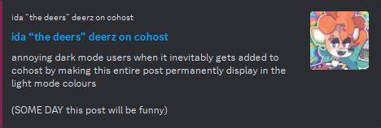
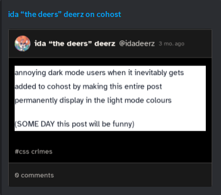

# cohost-embed

let's say we wanna share [this post](https://cohost.org/idadeerz/post/2410123-div-style-width-10) with our lovely friends. if we let cohost generate our embed, we get something a little like this.



**joke ruined :(**

but what if...



**joke saved :)**

## usage

1. take your post url (e.g. `https://cohost.org/idadeerz/post/2410123-div-style-width-10`)
2. position your cursor between `cohost.org` and the first `/`
3. type `.doggirl.gay` (thus turning the domain into `cohost.org.doggirl.gay`)

for example (spaces added for clarity):

```
https://cohost.org            /idadeerz/post/2410123-div-style-width-10
https://cohost.org.doggirl.gay/idadeerz/post/2410123-div-style-width-10
```
